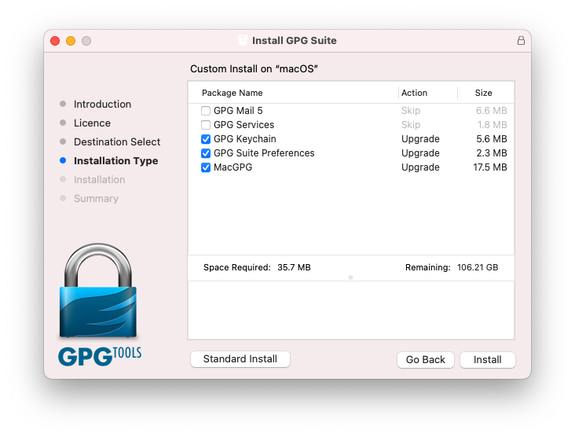

# tanuki

Hi! I'm **[Cariad](https://cariad.io)**. I'm a **Python developer** by trade.

I run **Visual Studio Code on a MacBook Pro** (_macaroni_), and use the Remote SSH extension to **develop, run and test my code on an Intel NUC** (_tanuki_).

This project holds my **scripts and documentation** for setting up _tanuki_ from an empty box to a **remote Python development machine**.

With thanks to [@dmrz](https://github.com/dmrz) for [inspiring](https://dimamoroz.com/2021/03/09/intel-nuc-for-development/) me to finish this!

## Assumptions and requirements

This guide assumes you have a Mac running **macOS 11.0 Big Sur or later**, and that you intend to install **Ubuntu Server 20.10** onto an **Intel NUC10i5FNH NUC** (or compatible).

## Building your own _tanuki_

<span style="font-size: smaller; font-style: italic;">This list contains Amazon UK affiliate links. As an Amazon Associate, I earn from qualifying purchases.</span>

If you want to follow along, these are the parts I use:

- [Intel NUC10i5FNH NUC](https://amzn.to/3d1HEud)
- [Corsair Vengeance 32 GB RAM](https://amzn.to/3r8yqkF)
- [Samsung 980 PRO 250 GB](https://amzn.to/3ccXYcm)
- [Samsung 32 GB USB](https://amzn.to/3lEV7Mg)

## Prepare an SSH key pair

We'll use an SSH key pair to authenticate SSH connections into _tanuki_.

1. On your Mac:

    ```bash
    ssh-keygen -t ed25519 -C cariad@hey.com  # Use your own email address
    ssh-add -K ~/.ssh/id_ed25519             # Add to ssh-agent to remember your passphrase
    pbcopy < ~/.ssh/id_ed25519.pub           # Copy your public key to the clipboard
    ```

1. Add your new key [to your GitHub account](https://github.com/settings/ssh/new).

## Prepare a GPG key pair

We'll use a GPG key to sign our git commits.

1. [Download](https://gpgtools.org/) and install GPG Suite. If you plan on only using `gpg` on the command-line then customise the installation to disable **GPG Mail** and **GPG Services**.

    

1. Generate a key following the on-screen instructions:

    ```bash
    gpg --generate-key
    ```

## Prepare an Ubuntu USB stick

1. [Download Ubuntu Server 20.10](https://ubuntu.com/download/server#downloads). Use BitTorrent; I like [transmission/transmission](https://github.com/transmission/transmission).
1. Burn the ISO to a USB stick. I like [balena-io/etcher](https://github.com/balena-io/etcher).

## Set up _tanuki_'s hardware

Connect _tanuki_ to a keyboard, monitor and network.

TODO: UEFI.

## Install Ubuntu

1. Install:
    1. Select your language (English UK)
    1. Offer to use later installer: accept.
    1. Identify keyboard. The default English US seems to be fine.
    1. Network. Check IPv4 DHCP is enabled.
    1. No proxy.
    1. Ensure GB mirror is prefilled.
    1. Use entire disk, but disable LVM group.
    1. Ensure the mount point has the same size as your disk.
    1. Your name: Cariad
    1. Server's name: tanuki
    1. Username: cariad
    1. Password: ********
    1. Yes to install OpenSSH server.
    1. Yes to import keys from GitHub.
    1. Allow password auth over SSH? NO.
    1. Featured snaps: disable all.
1. Wait, then reboot.
1. Login.

## Bootstrap SSH

On the NUC:

```bash
git clone https://github.com/cariad/tanuki ~/.tanuki
cd ~/.tanuki
./bootstrap.sh
```

At this point, you should be able to SSH from your Mac into _tanuki_ at **tanuki.local**:

```bash
ssh cariad@tanuki.local
```

Disconnect your monitor and keyboard from _tanuki_ and work from an SSH session for the remainder.

## OPTIONAL: Test CPU scaling

Run:

```bash
sudo apt install sysbench
sysbench cpu --cpu-max-prime=10000000 --threads=8 run
```

Make a note of **total time** under **General statistics**. It could be ~30 seconds.

## Upload your private GPG key

On your Mac:

```bash
./upload-gpg-key.sh -host tanuki6.local -host-user cariad -key cariad@hey.com
```

## Install and configure all the things

In an SSH session on _tanuki_:

```bash
cd ~/.tanuki
./setup.sh
```

You will be prompted to enter your secret GPG key passphrase. This is required to import the key.

When the installation is complete, reboot _tanuki_ then reconnect.

## OPTIONAL: Verify CPU scaling

Run:

```bash
sysbench cpu --cpu-max-prime=10000000 --threads=8 run
```

Compare **total time** to the total you recorded earlier. It _should_ be significantly faster; ~15 seconds.
